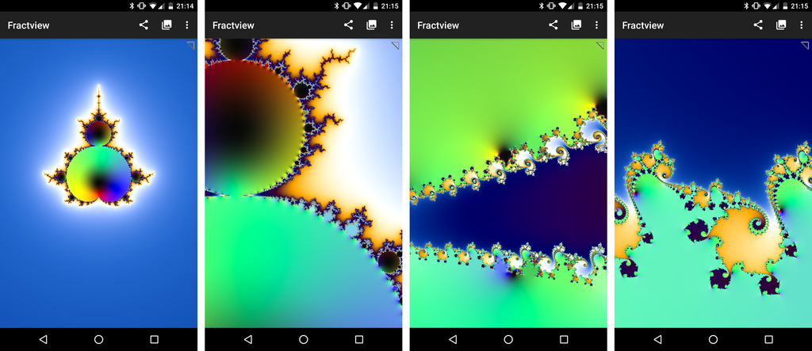
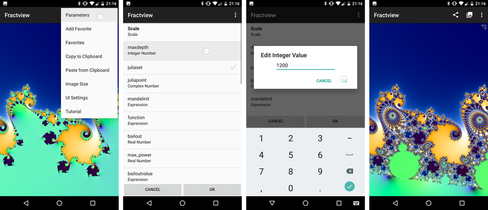
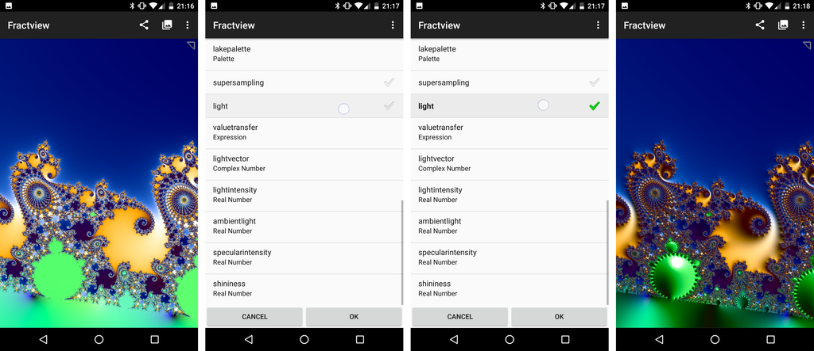
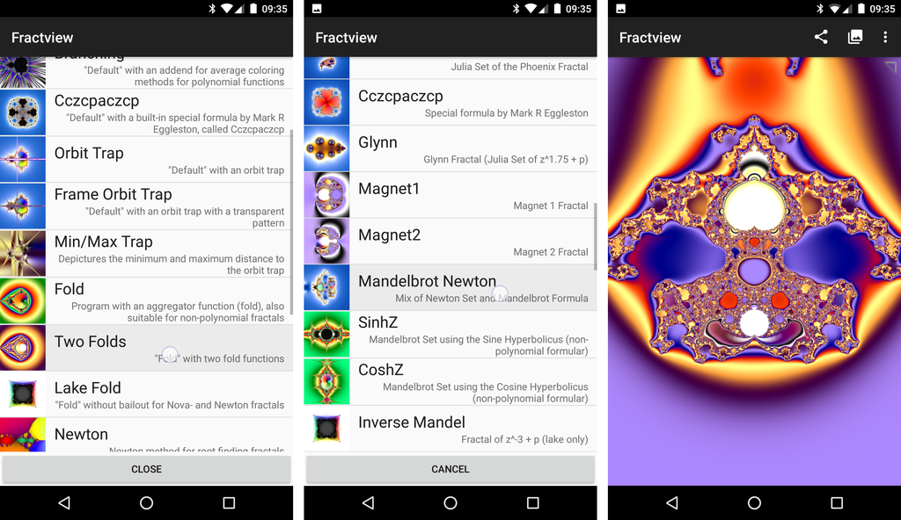
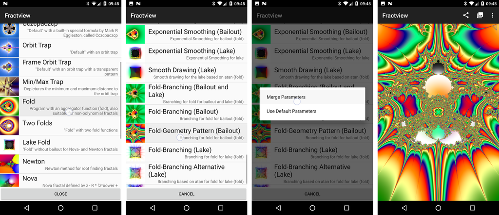
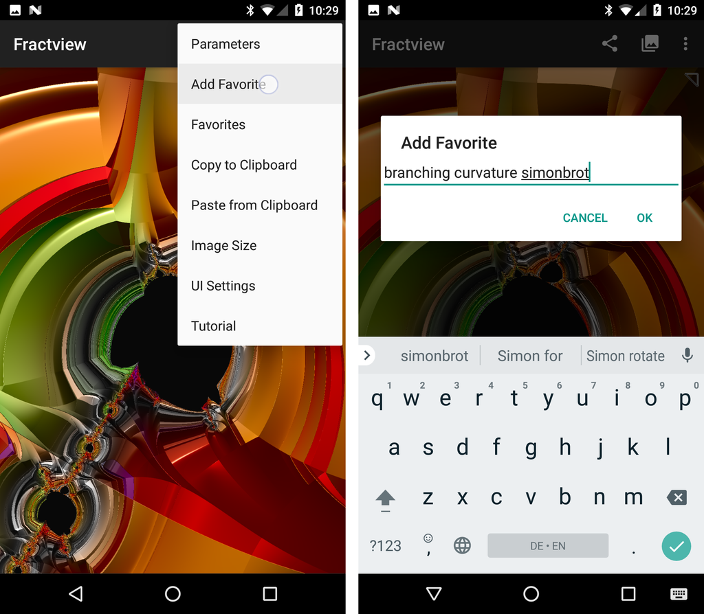
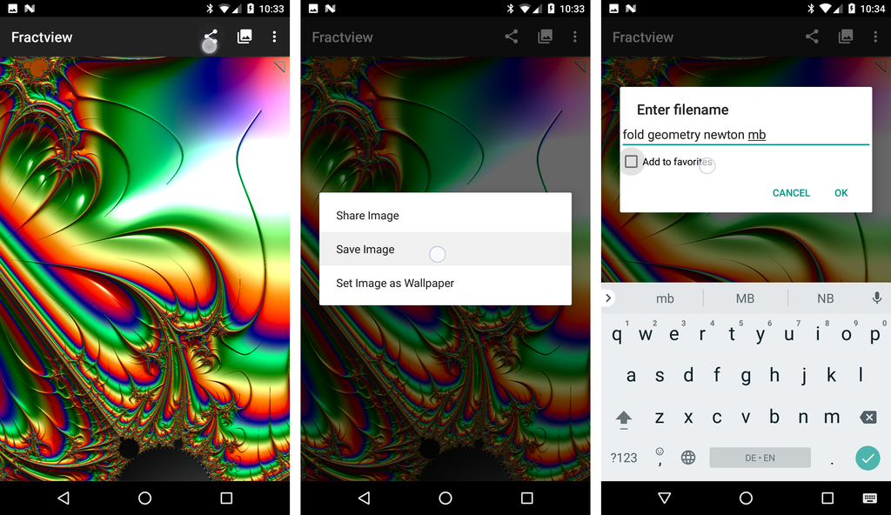

# Quick start

Fractview is a free, [open source](https://github.com/searles/FractviewAndroid) app for Android 5+ to render fractals. Fractals are images that you can enlarge as much as possible and still see a structure. You will encounter all kinds of nice shapes, spirals, dendrites, and also the original shape itself (a phenomenon called self-similarity) in these "mathematical monsters".

No app is perfect, please use the [feedback function in the play store](https://play.google.com/store/apps/details?id=at.searles.fractview) to report bugs, for feature requests or to leave a review.

In the following, you find basic information on some features of Fractview. 

Please refer to [the blog](http://fractview.wordpress.com) for further topics about this app.

## First steps

After starting Fractview, a picture of the Mandelbrot Set is rendered. The progress of the rendering is indicated by a progress bar below the title bar (it is hidden after the rendering has finished). Using pinch-to-zoom and double-tap you can zoom into the fractal to discover further structures. 

The app supports portrait and landscape mode. The image is eventually rotated by 90 degrees to fill out as much space as possible while keeping the aspect ratio. If the image is rotated, a small triangle will appear to mark the top left corner of the image.

Fractview is very feature rich. In the following an overview of some features is given.

## Parameters

Fractview allows you to freely modify parameters of the image that is drawn. You can manipulate these parameter by selecting "Parameters" in the menu or by tapping the icon . In this view you can enter custom formulas, change the color palettes or add a 3D effects. When zooming into the fractal, the most important parameter is "maxdepth" because the larger it is the more details become visible at deeper zooms.

 

Notice that the parameters that were modified appear now in bold letters, meaning that these parameters contain custom values (as opposed to default values). Using a long tap, a menu appears in which you can revert parameters to their default value (some arguments also contain further options).

Another interesting parameter is "light". You can toggle its state with a single tap. If it is checked, you obtain a nice 3D effect.

 

Fractview allows you to create custom (two dimensional) color palettes using an intuitive palette editor and color picker. The *bailoutpalette* contains the colors used of the outside of the fractal (in the Default program it uses only one dimension), the *lakepalette* is used for the inside (this one uses two dimensions).

## Presets/Demos

Fractview contains some demos/presets, accessible via . The demos-view consists of two screens. In the first screen you pick a program that will render the image. There are many different programs to draw basic fractals like the mandelbrot set, newton fractals, [lyapunov fractals](https://en.wikipedia.org/wiki/Lyapunov_fractal), [magnetic pendulum simulations](https://nylander.wordpress.com/2007/10/27/magnetic-pendulum-strange-attractor/) or simply [complex functions](https://en.wikipedia.org/wiki/Domain_coloring#Visual_encoding_of_complex_numbers). You can select a program using a single tap. The first entry ("Current") will keep the current program.

In the second view you can select a set of parameters, for instance a new formular to generate the fractal or a special colorization method. Every program contains different parameters but some can be used in multiple programs. 

Using a long tap you can also merge a parameter set with the current parameters. If you merge the current fractal with a parameter set in the Preset view, the current parameters will be used unless they are overridden by the new parameter set. If a program cannot interpret a parameter set (for instance if the parameter set requires values that do not exist in the selected program), you might encounter an error message though.

 

## Favorites

Fractview allows you to save the current fractal. From the main view, you can add your favorites using "Add to Favorites". 

You can also directly add a favorite when you save the image. 

To access your favorites, pick "Favorites" from menu. It will open a new view in which you can pick a favorite using a single tap. Using a long tap you can select multiple entries that you can delete or export to share with others. The collection itself is one text file containing the fractal data as a Json, hence if you are experienced in Json you can even edit this file in a text editor. The icon is stored in PNG-Format, encoded as Base64.

You can also import collections from others. [In my blog](https://fractview.wordpress.com) you will find some links to collections. After downloading a file, select "import" and select the downloaded collection. After importing a collection all new entries are selected. In order to group the new entries you can set a common prefix so that they will appear next to each other. 

## Other menus

"Share"  opens a menu where you can select to either share the current picture, save it to the gallery or use it as a wallpaper. If the rendering is not yet finished, saving will be stalled. 

You can also copy a fractal into the clipboard and paste it somewhere else (this way I share fractals with my daughter via Google Hangouts).

You can set a custom image size. There is no limit apart from your memory. Image sizes around 4000x3000 should be no problem.

There is a menu "UI Settings" that lets you display a grid, activate rotation lock, confirm zooms using a single tap or deactivate the zoom controls at all.

# Finally

Fractview is open source and (ad-)free and always will be, there will never be a non-free premium version or a non-free feature. If you want to show your appreciation [you will find a link for donations in my blog](https://fractview.wordpress.com/about/).

Thanks for your interest in my little app. 

-- Karl
